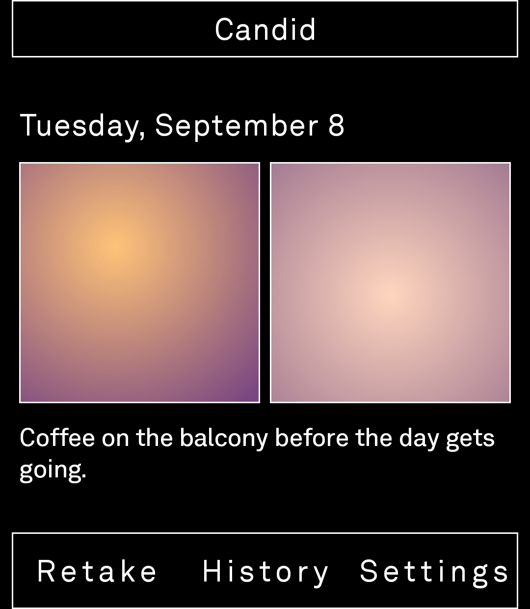
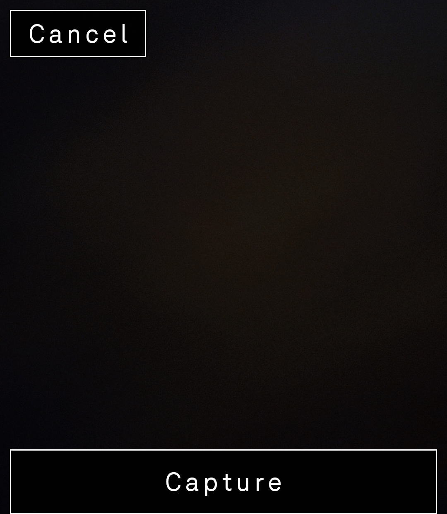
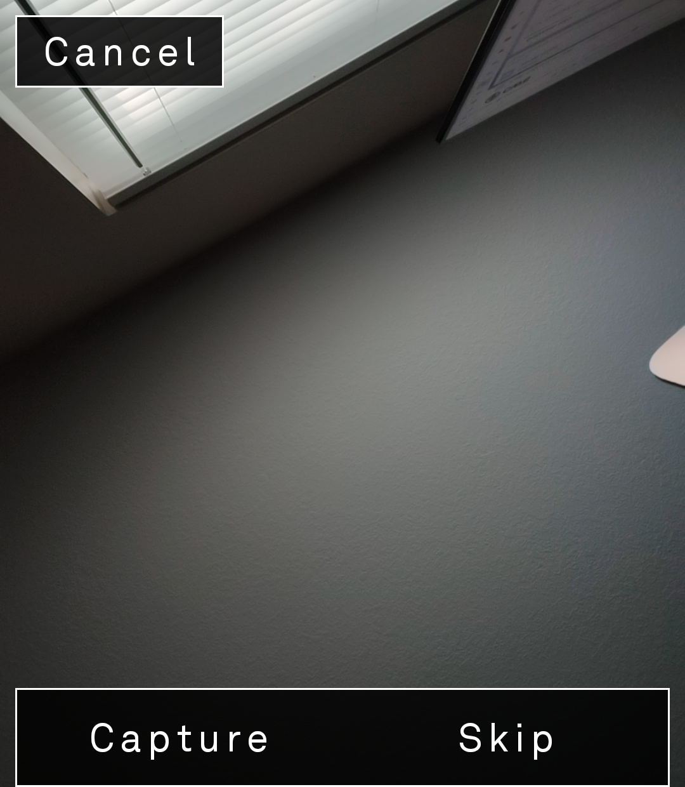
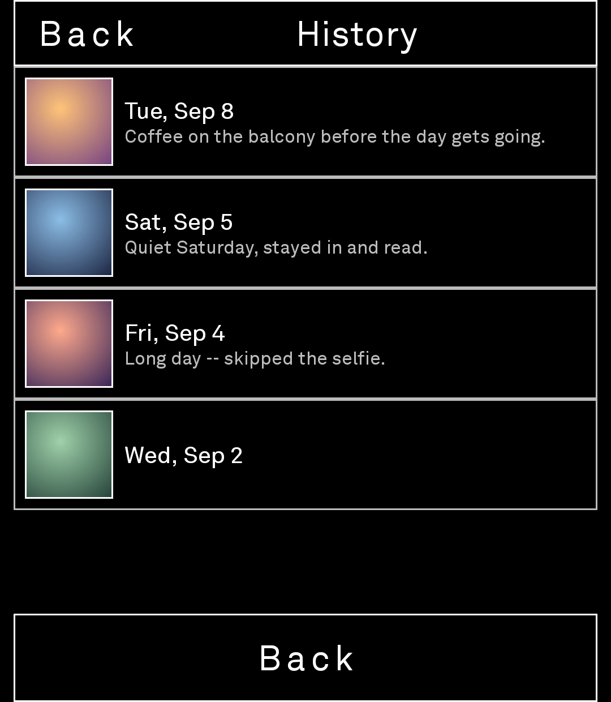
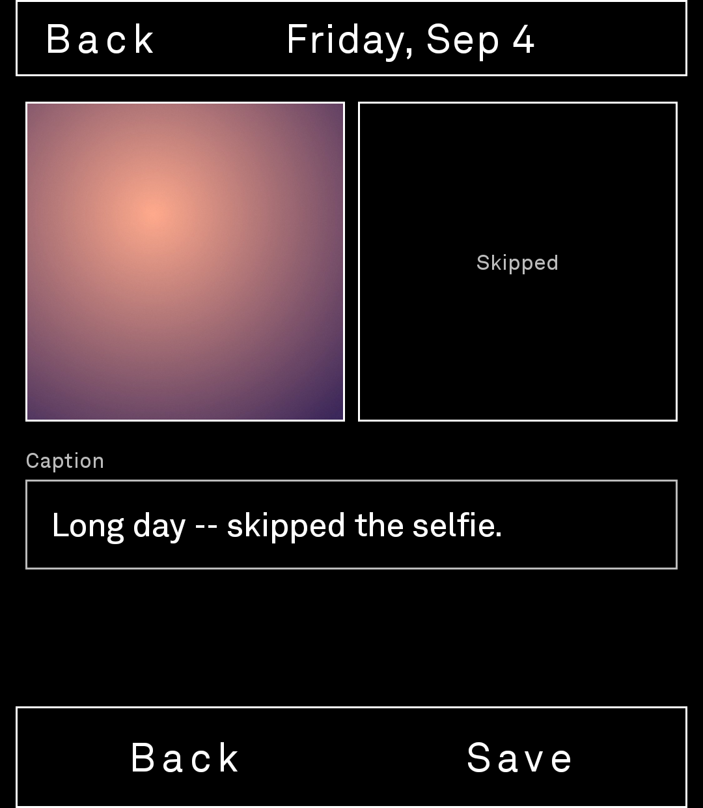
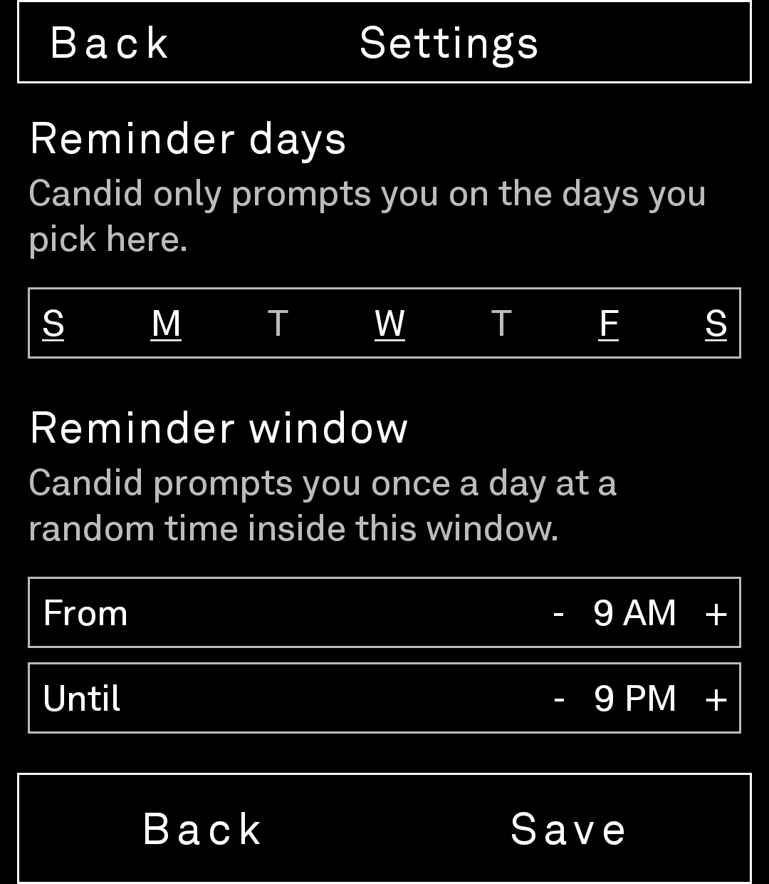
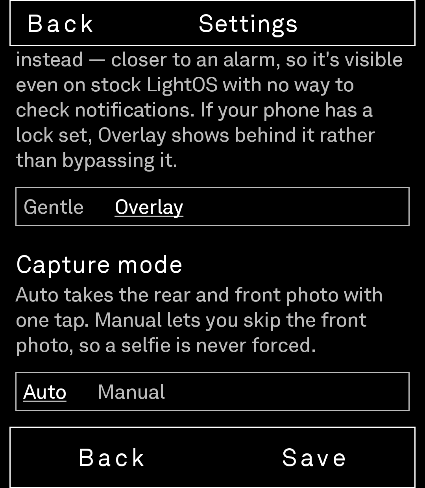

# Candid

A local-only daily photo journal for the Light Phone III. Once a day, at a randomized time,
Candid sends a notification. Open it whenever you're ready and it captures a rear photo,
then a front photo, pairs them as one entry, and lets you add a short caption — a private,
offline take on the "BeReal" idea with no accounts, no networking, and no social feed.

**Version 1.0.** Grab the latest APK from [Releases](../../releases). If anything feels off,
breaks, or works differently than you'd expect, please [open an issue](../../issues/new) —
real-world feedback from LP3 owners is still exactly what keeps this moving forward.

## Screenshots

<table>
  <tr>
    <td align="center"><br><sub>Today's entry</sub></td>
    <td align="center"><br><sub>Capture — rear</sub></td>
    <td align="center"><br><sub>Capture — front, Manual mode</sub></td>
  </tr>
  <tr>
    <td align="center"><br><sub>History</sub></td>
    <td align="center"><br><sub>Entry detail, front skipped</sub></td>
    <td align="center"><br><sub>Settings — days &amp; window</sub></td>
  </tr>
  <tr>
    <td align="center"><br><sub>Settings — reminder style &amp; capture mode</sub></td>
  </tr>
</table>

*Journal photos shown above are generated sample images standing in for real captures —
nothing you take with Candid ever leaves your device.*

## Why standalone

The official Light SDK's sandboxed tool model doesn't yet expose photo capture, local
notifications, or exact-time alarm scheduling to third-party tools. This app follows the
precedent set by other independent Light Phone III projects (`zero`, `Luma`) and is built as
a normal standalone Android app, sideloaded rather than distributed through the tool store.
Platform access (camera, notifications, storage) is isolated behind small interfaces in
`capture/`, `notifications/`, and `storage/` so the business logic could realistically move
into a real sandboxed tool later, if Light exposes these primitives.

## Design

Visually ported by hand from Light's own design tokens (grayscale palette, 12-step type
scale, 27x27 grid spacing, flat hairline-border aesthetic) — see `theme/`. Captured photos
and previews are never desaturated; only UI chrome uses the grayscale palette.

## Building

Requires JDK 17+ and the Android SDK (API 34-36 platform + build-tools).

```bash
./gradlew :app:assembleDebug
```

A debug build installs as its own app (`app.candid.debug`, labeled "Candid Dev") — separate
storage and database from a release install, so trying a dev build never touches a real
journal already on the device.

## Installing

Download the latest signed APK from [Releases](../../releases), enable "Install unknown
apps" for your file manager/browser, and install it directly.

After installing, open Candid once and grant Camera and Notification permissions when
prompted. On Android 12+ you may also need to enable "Alarms & reminders" for Candid in
system settings (Settings → Apps → Candid → Alarms & reminders) for the daily reminder to
fire at a precise time — without it, reminders still arrive, just less precisely.

LightOS runs the screen in grayscale via the stock Android "Color correction" accessibility
feature, applied at the display level — it doesn't show up in screenshots, only on the actual
panel. Candid switches it off while open so photos and the viewfinder render in real color,
then restores it on exit, but that needs one privileged permission you have to grant
yourself over USB once after installing:

```bash
adb shell pm grant app.candid android.permission.WRITE_SECURE_SETTINGS
```

Without it, Candid just no-ops and stays grayscale like the rest of the OS — nothing breaks.

## Data

Everything stays on-device: photos are stored in the app's private storage (not the shared
gallery), and the journal index lives in a local database. Nothing is uploaded anywhere.
